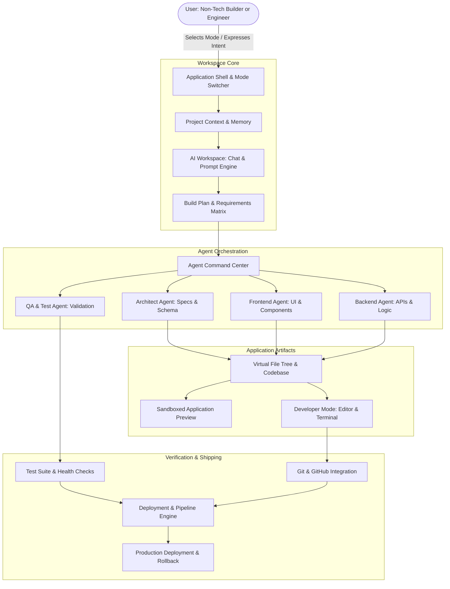
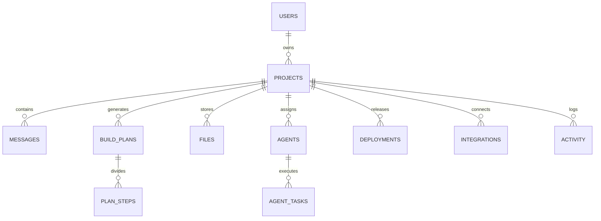

# Architect 2.0 — Comprehensive Implementation Plan & Engineering Blueprint

> **Document Version:** 1.0.0  
> **Status:** Final Architectural Proposal  
> **Role:** Lead Product Architect & Senior Full-Stack Engineer  
> **Estimated Execution Time:** 48 Hours (2-Day Accelerated Prototype)  
> **Target Platform:** Next.js 14+ (App Router), TypeScript, Tailwind CSS, Node.js v24  

---

## 1. Executive Summary

### 1.1 Product Vision & Core UX Strategy
**Architect 2.0** is an AI-native software development workspace engineered to solve the fundamental dichotomy in current AI tooling: **simplicity vs. technical control**. Current platforms force a compromise: non-technical users get isolated in simplistic "prompt-to-app" generators that hit a complexity ceiling, while software engineers juggle fragmented tools (terminals, IDEs, GitHub, database consoles, cloud dashboards, and coding agents).

Architect 2.0 bridges this divide through one foundational principle:
> **"Simple by default. Powerful when needed."**  
> *One project. One workspace. Multiple adaptive levels of control.*

The product supports the full software development lifecycle:  
$$\text{Idea} \longrightarrow \text{Requirements} \longrightarrow \text{Plan} \longrightarrow \text{Build} \longrightarrow \text{Preview} \longrightarrow \text{Iterate} \longrightarrow \text{Code} \longrightarrow \text{Test} \longrightarrow \text{Collaborate} \longrightarrow \text{Deploy}$$

### 1.2 Dual-Mode Interaction Paradigm
Rather than bifurcating the user base into separate tools, Architect 2.0 provides an instantaneous, zero-latency **Mode Switcher** within the same project context:
- **Build Mode (for Founders, PMs, Designers, Operators):** Natural language conversation, structured visual build plans, live interactive app previews, agent milestone tracking, and 1-click cloud deployments.
- **Developer Mode (for Developers, AI Engineers, Tech Leads):** Multi-pane IDE with file trees, syntax-highlighted code editor, diff viewer, interactive terminal & test runner, branch/PR manager, database schema visualizer, environment variable manager, and agent task inspector.

### 1.3 Technical Strategy
Given the strict **2-day prototype constraint**, the architecture balances **visual excellence and end-to-end user flows (Priority 1)** with **broad feature coverage (Priority 2)** and **strategic working functionality (Priority 3)**.
- **Frontend:** Next.js 14+ App Router, React 18/19, TypeScript, Tailwind CSS, Lucide icons, custom fluid UI primitives (no rigid third-party UI framework lock-in).
- **State & Real-Time Sync:** Zustand for client-side state orchestration (project context, agent state machines, terminal history, layout docking), paired with Next.js Server Actions and Route Handlers.
- **Persistence:** Local filesystem JSON/SQLite database with RESTful Route Handlers. Zero external cloud configuration required for local evaluation, yet architecture is 100% compatible with Supabase/PostgreSQL.
- **AI Engine (Hybrid Model):**
  - **Real Mode:** Configurable OpenAI / Anthropic / Groq API integration for real-time requirement breakdown, user chat, and code synthesis.
  - **Deterministic Smart Simulation Mode:** Zero-dependency fallback engine that generates realistic streaming tokens, file tree modifications, agent steps, test results, and deployment logs if no API key is provided or when offline.
- **Application Preview:** Sandboxed `iframe` rendering real interactive mini-apps with hot-reload simulation, viewport switches (Desktop/Tablet/Mobile), console logs, and visual element inspector.

### 1.4 Reality Matrix (Real vs. Simulated vs. Out of Scope)

| Category | Real Functionality | Simulated / Mocked Functionality | Out of Scope |
| :--- | :--- | :--- | :--- |
| **Authentication** | Local session auth, user profile switching, route guards | Cloud OAuth handshake (GitHub/Google buttons bypass to active session) | MFA, enterprise SSO (SAML/Okta) |
| **Project Management** | Create, clone, rename, delete, persist projects in storage | Git clone from live remote GitHub URL | Multi-gigabyte repository indexing |
| **Workspace & Modes** | Real-time Build Mode ↔ Developer Mode toggle, persistent state | Dynamic IDE pane resizing and tab persistence | Full VS Code extension marketplace |
| **AI & Build Workflow** | Real LLM streaming responses (when API key present), prompt intent parsing | Multi-agent coordination engine (deterministic agent pipeline fallback) | Multi-minute autonomous background agent swarm |
| **Code & File Tree** | Real file system explorer, file creation/edit/save, diff view, syntax highlighting | Full Language Server Protocol (LSP) intellisense | Native compiler toolchains (Rust, C++) |
| **Terminal & Tests** | Real interactive shell simulation with `npm test`, `git status`, `deploy`, `ls` | Actual Linux container sandbox execution | Arbitrary root shell access, Docker daemon |
| **Preview** | Real rendered web application inside sandboxed viewport with working interactions | Full server-side SSR container execution | Multi-node microservice runtime |
| **GitHub Integration** | Branch switching, commit history viewer, pull request creation flow | Direct write to remote GitHub enterprise repos | Complex 3-way merge conflict editor |
| **Database & Config** | Schema table visualizer, record inspector, environment variable vault | Live PostgreSQL connection pooling | Database clustering, read-replica management |
| **Deployment** | Multi-stage deployment pipeline, live deployment URL generator, rollbacks | Multi-region AWS/Vercel edge network routing | Kubernetes cluster provisioning |

### 1.5 2-Day Execution Roadmap Overview
- **Day 1 (Morning & Afternoon):** Project Foundation, Design System, App Shell, Authentication, Project Dashboard, and Project Creation / Import Wizard.
- **Day 1 (Evening & Night):** AI Workspace (Build Mode), Chat Streaming, Build Plan Orchestrator, Live Preview Sandbox, and Agent Timeline.
- **Day 2 (Morning):** Developer Mode (Code Editor, File Tree, Diff Viewer, Interactive Terminal, Test Runner).
- **Day 2 (Afternoon):** GitHub Workflows, Database Visualizer, Environment Manager, Deployment Engine & History.
- **Day 2 (Evening & Polish):** Seed Data (3 complete reference projects), Error/Loading/Empty states, UI micro-interactions, comprehensive end-to-end user walkthroughs.

---

## 2. Product Architecture

Architect 2.0 acts as the orchestration layer between **Human Intent** and **Software Execution**.



### Layer Roles & Responsibilities
1. **User Layer:** Accommodates both conversational natural-language queries ("Add dark mode to the billing table") and imperative engineering operations ("Branch from main, edit `api/billing.ts`, run tests").
2. **Project Layer:** The single source of truth encapsulating metadata, files, chat history, build steps, agent task trees, git branches, and environment settings.
3. **AI Workspace Layer:** Ingests human intent, extracts requirements, tracks context, clarifies ambiguities, and formulates verifiable tasks.
4. **Build Plan Layer:** Converts high-level requests into ordered, transparent milestones (e.g., Schema Definition → Component Creation → Integration → Testing).
5. **Agent Orchestration Layer:** Visualizes specialized agents executing isolated duties with clear states: `idle`, `thinking`, `writing`, `testing`, `completed`, `failed`.
6. **Application & Preview Layer:** Immediate visual feedback loop. The user sees their application being constructed step-by-step.
7. **Code & Git Layer:** Gives developers full transparency. Files are inspectable, editable, diffable, and committable to branches and PRs.
8. **Testing Layer:** Automated and user-triggered tests that validate code health prior to release.
9. **Deployment Layer:** Release staging, live URL generation, environment configuration checks, and instant rollbacks.

---

## 3. Information Architecture & Route Structure

The information architecture provides clean separation between global workspace management and project-specific operations, while ensuring Build Mode and Developer Mode share identical routing states.

```
/                                   -> Landing Page (Product value, features, live interactive demo CTA)
├── /login                          -> Authentication & Profile Selection (Instant switch between demo users)
├── /dashboard                      -> Projects Hub (Recent projects, templates, system health, stats)
├── /projects/new                   -> Project Creation & Import Studio (Blank canvas, templates, GitHub import)
│
└── /projects/[id]                  -> Main Unified AI Workspace (Root entry point)
    │                                  * Defaults to Build Mode or last-active mode
    │                                  * Query param or state toggle: ?mode=build | ?mode=dev
    ├── /preview                    -> Dedicated Fullscreen Preview (Presentation & user testing)
    ├── /code                       -> Direct Developer View (Code editor, file tree, diffs)
    ├── /agents                     -> Agent Command Center (Multi-agent swarm monitor & task logs)
    ├── /github                     -> Git & GitHub Hub (Branches, commits, pull requests, sync)
    ├── /database                   -> Database & Schema Studio (Tables, visual schema, record browser)
    ├── /integrations               -> Third-Party Services & Webhooks (Stripe, Auth0, Resend, Supabase)
    ├── /environment                -> Environment Variables & Secrets Vault (Encrypted env key-values)
    ├── /deployments                -> Deployment Pipeline & History (Build logs, live domains, rollbacks)
    ├── /activity                   -> Audit Trail & Project History (Chronological change timeline)
    └── /settings                   -> Project Settings (General, Danger Zone, Collaborators)

/settings                           -> Global User & Platform Settings (AI API Keys, Theme, Profiles)
```

### Routing Improvements & Rationale
1. **Unified Root `/projects/[id]`:** Rather than forcing users into separate `/build` vs `/dev` URLs, `/projects/[id]` holds the stateful workspace. Mode switching is instantaneous (via React state or query param `?mode=dev`) preserving scroll position, open tabs, and terminal sessions.
2. **Sub-Route Deep Linking:** Directly accessing `/projects/[id]/database` opens the project directly focused on the Database Studio inside the Developer Mode frame.
3. **Dedicated Fullscreen Preview (`/projects/[id]/preview`):** Allows stakeholders to interact with the generated app cleanly without IDE chrome.

---

## 4. Phase-Wise Implementation Roadmap

We structure the development into **19 cohesive, progressive phases**, optimized for a 2-day delivery cycle:

```mermaid
gantt
    title Architect 2.0 Two-Day Implementation Timeline
    dateFormat  HH:mm
    axisFormat  %H:%M
    
    section Day 1: Foundation & Build Mode
    Phase 0 - Setup & Architecture          :done, 00:00, 2h
    Phase 1 - Foundation & Project Init     :done, 02:00, 2h
    Phase 2 - Design System & Shell         :active, 04:00, 3h
    Phase 3 - Auth & Onboarding             :07:00, 2h
    Phase 4 - Dashboard & Project Hub       :09:00, 2h
    Phase 5 - Creation & GitHub Import      :11:00, 3h
    Phase 6 - AI Workspace & Chat           :14:00, 3h
    Phase 7 - Build Plan Orchestrator       :17:00, 3h
    Phase 8 - Agent Swarm Command Center    :20:00, 2h
    Phase 9 - Live App Preview Sandbox      :22:00, 2h
    
    section Day 2: Developer Mode & Shipping
    Phase 10 - Developer Mode IDE & Code    :00:00, 3h
    Phase 11 - GitHub, Branches & PRs       :03:00, 2h
    Phase 12 - Database & Integrations      :05:00, 2h
    Phase 13 - Env Secrets & Config         :07:00, 1.5h
    Phase 14 - Testing & Project Health     :08:30, 2h
    Phase 15 - Deployment & Rollbacks       :10:30, 2.5h
    Phase 16 - Activity Log & History       :13:00, 1.5h
    Phase 17 - Empty, Error & Edge States   :14:30, 2h
    Phase 18 - Polish, Audit & Submission   :16:30, 3h
```



---

## 5. Details Required For Every Phase

### PHASE 0: Project Analysis & Technical Architecture
- **Objective:** Finalize project repository scaffolding, define coding conventions, establish zero-build-fail rules, and document architectural invariants.
- **User Problem Solved:** Eliminates downstream technical debt and ensures clean, modular structure.
- **User Flow:** Developer initializes the environment and verifies build and dev scripts.
- **Screens/Pages:** Documentation and repo root files.
- **Components:** Configuration files (`tsconfig.json`, `tailwind.config.ts`, `package.json`).
- **Data/State:** Baseline filesystem and git repository.
- **Backend/API/DB Requirements:** Node.js v24 compatibility, Next.js 14 setup.
- **AI Requirements:** None.
- **Real Functionality:** Next.js dev server running on port 3000.
- **Simulated Functionality:** None.
- **Dependencies:** None.
- **Acceptance Criteria:** `npm run dev` and `npm run build` execute with 0 errors.
- **Estimated Time:** 1.5 Hours | **Priority:** P0

---

### PHASE 1: Project Foundation & Core Utilities
- **Objective:** Setup utility libraries, persistence storage wrapper, mock database seeds, and type definitions.
- **User Problem Solved:** Provides reliable local data persistence so projects, messages, and files persist across browser refreshes.
- **User Flow:** Background data initialization.
- **Screens/Pages:** N/A (Core foundation).
- **Components:** `storage.ts`, `types.ts`, `seedData.ts`, `api-client.ts`.
- **Data/State:** JSON filesystem store in `/data` or browser localStorage fallback.
- **Backend Requirements:** Next.js Route Handlers for `/api/projects`, `/api/projects/[id]`.
- **API Requirements:** GET, POST, PUT, DELETE for project lifecycle.
- **Database Requirements:** In-memory + File-backed JSON schema (mirrors PostgreSQL).
- **AI Requirements:** None.
- **Real Functionality:** File-backed CRUD operations for projects, messages, and virtual files.
- **Simulated Functionality:** None.
- **Dependencies:** Phase 0.
- **Acceptance Criteria:** API route returns mock projects with full relations (agents, plans, files).
- **Estimated Time:** 2 Hours | **Priority:** P0

---

### PHASE 2: Design System & Application Shell
- **Objective:** Build a bespoke, first-principles dark-mode UI design system and the overarching responsive `AppShell`.
- **User Problem Solved:** Gives the product an ultra-premium, professional, focused developer aesthetic without generic UI templates.
- **User Flow:** User navigates between global pages and project views using the top bar, sidebar, and mode switcher.
- **Screens/Pages:** Global layout wrapper, TopBar, Sidebar, Mode Toggle.
- **Components:** `AppShell`, `TopNav`, `SideNav`, `ModeToggle`, `Button`, `Badge`, `Card`, `Modal`, `Toast`, `Dropdown`, `Tabs`.
- **Data/State:** Active project state, active mode (`build` vs `dev`), sidebar collapse state.
- **Backend Requirements:** None.
- **API Requirements:** None.
- **Database Requirements:** None.
- **AI Requirements:** None.
- **Real Functionality:** Fluid animations, responsive sidebar collapse, seamless ModeToggle with hotkey (`Cmd+K` or `Cmd+M`).
- **Simulated Functionality:** None.
- **Dependencies:** Phase 1.
- **Acceptance Criteria:** Mode switcher transitions UI smoothly without losing active project context or triggering page reloads.
- **Estimated Time:** 3 Hours | **Priority:** P0

---

### PHASE 3: Authentication & Onboarding
- **Objective:** Deliver an authentic, friction-free authentication experience with instant profile switching (Non-Technical Founder vs Senior Technical Engineer).
- **User Problem Solved:** Evaluators can immediately test both user personas without tedious email verification hurdles.
- **User Flow:** Landing/Login → Select Persona ("Alex - Non-Tech Founder" or "Sarah - Staff Software Engineer") → Instant session start → Redirect to personalized dashboard.
- **Screens/Pages:** `/login`, user profile drawer.
- **Components:** `LoginForm`, `PersonaSwitcher`, `UserAvatarMenu`, `AuthGuard`.
- **Data/State:** `user` session object (name, email, role, avatar, recent projects).
- **Backend Requirements:** `/api/auth/session`, `/api/auth/login`, `/api/auth/logout`.
- **API Requirements:** Session verification and cookie/localStorage management.
- **Database Requirements:** `users` table seeded with 2 rich personas.
- **AI Requirements:** None.
- **Real Functionality:** Working session persistence, profile switching, logout, protected route redirect.
- **Simulated Functionality:** OAuth external popup redirects immediately to successful auth.
- **Dependencies:** Phase 2.
- **Acceptance Criteria:** Switching personas alters dashboard defaults (e.g. Alex defaults to Build Mode; Sarah defaults to Dev Mode).
- **Estimated Time:** 1.5 Hours | **Priority:** P1

---

### PHASE 4: Homepage & Project Dashboard
- **Objective:** Create the main command center showcasing existing projects, health metrics, quick creation triggers, and recent activity.
- **User Problem Solved:** Eliminates the blank canvas and grounds the user in their active software portfolio.
- **User Flow:** Login → Dashboard → Browse projects → Filter by tags (SaaS, Internal Tool, API) → Click project to open workspace.
- **Screens/Pages:** `/dashboard`.
- **Components:** `ProjectGrid`, `ProjectCard`, `MetricCard`, `RecentActivityTimeline`, `SearchFilterBar`, `NewProjectButton`.
- **Data/State:** Project list, active filters, search query.
- **Backend Requirements:** `GET /api/projects`.
- **API Requirements:** Search and filter query params.
- **Database Requirements:** Read from `projects` and `deployments`.
- **AI Requirements:** None.
- **Real Functionality:** Search by name/tech, tag filtering, project deletion, status badges (`Live`, `Building`, `Draft`).
- **Simulated Functionality:** Real-time metrics counters (simulated uptime & API calls).
- **Dependencies:** Phase 3.
- **Acceptance Criteria:** Displays at least 3 rich preloaded projects with thumbnail previews, live status badges, and git branch indicators.
- **Estimated Time:** 2 Hours | **Priority:** P0

---

### PHASE 5: New Project Creation & GitHub Import Wizard
- **Objective:** Build an intuitive dual-path project creation studio: "Start from Idea" (Natural Language) or "Import Existing Repository" (GitHub).
- **User Problem Solved:** Solves Problem A (The blank canvas) and Problem D (Existing projects are hard to bring into AI builders).
- **User Flow:**
  - *Path A (Idea):* Enter prompt → Select target stack (Next.js, React, Node) → AI analyzes intent → Initializes project.
  - *Path B (Import):* Connect GitHub → Search repos → Select repo → AI parses architecture → Imports file tree.
- **Screens/Pages:** `/projects/new`.
- **Components:** `CreateProjectWizard`, `PromptIdeaInput`, `TemplateSelector`, `GitHubRepoList`, `RepoAnalysisModal`.
- **Data/State:** Form state, repo selection, AI analysis loading state.
- **Backend Requirements:** `POST /api/projects/create`, `POST /api/projects/import`.
- **API Requirements:** Project initialization with pre-populated files and initial build plan.
- **Database Requirements:** Insert new record into `projects`, `files`, and `build_plans`.
- **AI Requirements:** Intent parser that converts short description into an architectural brief.
- **Real Functionality:** Project creation with customized file structure, persistence to storage, auto-navigation to `/projects/[id]`.
- **Simulated Functionality:** GitHub repo import simulates fetching branches and commits from popular open-source presets.
- **Dependencies:** Phase 4.
- **Acceptance Criteria:** Creating an app from prompt creates a working project with realistic files and opens in Build Mode.
- **Estimated Time:** 2.5 Hours | **Priority:** P0

---

### PHASE 6: Main AI Workspace & Conversational Engine
- **Objective:** Construct the central AI interaction interface featuring streaming chat, context pill attachments, prompt suggestions, and command actions.
- **User Problem Solved:** Makes AI transparent, accessible, and iterative.
- **User Flow:** User enters prompt → Chat streams response → Chat tags affected files and proposed actions → Shows "Review Build Plan" button.
- **Screens/Pages:** `/projects/[id]` (Build Mode Left Panel).
- **Components:** `ChatPanel`, `MessageList`, `MessageBubble`, `PromptComposer`, `ContextChips`, `ActionSuggestionButtons`.
- **Data/State:** `messages[]`, `isStreaming`, `currentPrompt`, `activeContextFiles`.
- **Backend Requirements:** `POST /api/chat`, `GET /api/projects/[id]/messages`.
- **API Requirements:** Streaming SSE or chunked text response.
- **Database Requirements:** Append to `messages` table.
- **AI Requirements:** Hybrid: Real OpenAI/Groq streaming if `API_KEY` present; otherwise realistic simulated token streamer with realistic Markdown and code blocks.
- **Real Functionality:** Streaming response, markdown rendering, code block copy, message history persistence.
- **Simulated Functionality:** Token streaming fallback generator with realistic timing.
- **Dependencies:** Phase 5.
- **Acceptance Criteria:** Typing "Add Stripe checkout" yields a streaming response explaining the architecture, schema updates, and build plan.
- **Estimated Time:** 3 Hours | **Priority:** P0

---

### PHASE 7: AI Planning & Build Workflow
- **Objective:** Create the visual **Build Plan Orchestrator** that translates natural language requests into structured, reviewable, checkable milestones.
- **User Problem Solved:** Eliminates the "black box" fear (Problem B) and allows non-technical users to approve changes before execution.
- **User Flow:** User requests feature → AI generates Build Plan → User reviews steps → User clicks "Approve & Build" (or modifies steps) → Agent execution kicks off.
- **Screens/Pages:** `/projects/[id]` (Build Plan drawer / embedded panel).
- **Components:** `BuildPlanCard`, `PlanStepItem`, `StepStatusBadge`, `ApprovePlanButton`, `ModifyStepModal`.
- **Data/State:** `buildPlan` state machine (`proposed` → `approved` → `executing` → `completed`).
- **Backend Requirements:** `GET /api/projects/[id]/plan`, `POST /api/projects/[id]/plan/approve`.
- **API Requirements:** Step status updates and plan modification.
- **Database Requirements:** `build_plans` with steps array (`id`, `title`, `description`, `status`, `targetFiles`).
- **AI Requirements:** Structured JSON output schema generation for plans.
- **Real Functionality:** Plan approval triggers agent progress bar, updates step statuses sequentially, and emits file changes.
- **Simulated Functionality:** Automated step-by-step progress timer with pause/resume capabilities.
- **Dependencies:** Phase 6.
- **Acceptance Criteria:** User can inspect individual plan steps, edit a step title, approve the plan, and watch steps progress from pending to done.
- **Estimated Time:** 2.5 Hours | **Priority:** P0

---

### PHASE 8: Agent Command Center & Multi-Agent Swarm
- **Objective:** Build a dedicated **Agent Command Center** displaying specialized AI agents (Architect, Frontend, Backend, QA) collaborating on tasks.
- **User Problem Solved:** Provides deep visibility into what the AI is doing, which files are being touched, and lets users pause or intervene (Principle 2 & 3).
- **User Flow:** User opens Agent View → Observes active agents → Inspects thought logs, file diffs, and execution times → Can click "Pause Agent" or "Rollback Task".
- **Screens/Pages:** `/projects/[id]/agents` and inline Agent Bar in Build Mode.
- **Components:** `AgentSwarmView`, `AgentCard`, `AgentTimeline`, `AgentThoughtLog`, `AgentControls` (Pause, Resume, Abort).
- **Data/State:** `agents[]` (`id`, `role`, `status`, `currentTask`, `progress`, `logs[]`).
- **Backend Requirements:** `GET /api/projects/[id]/agents`, `POST /api/projects/[id]/agents/action`.
- **API Requirements:** Agent interruption and state modification.
- **Database Requirements:** `agents` and `agent_sessions`.
- **AI Requirements:** Agent thought traces (e.g. "Analyzing schema.prisma... Generating API route... Running linter...").
- **Real Functionality:** Agent state machine transitions, interactive pause/stop controls, real-time thought log feed.
- **Simulated Functionality:** Agent swarm parallel execution timelines with believable delays.
- **Dependencies:** Phase 7.
- **Acceptance Criteria:** User sees 4 distinct agents with clear visual status indicators and detailed streaming execution logs.
- **Estimated Time:** 2.5 Hours | **Priority:** P1

---

### PHASE 9: Application Preview Sandbox
- **Objective:** Build an interactive, live application preview container with device viewports, hot-reload simulation, interactive controls, and visual inspector.
- **User Problem Solved:** Provides non-technical and technical users instant gratification and visual feedback on what has been built.
- **User Flow:** User watches the UI render live → Clicks buttons, switches tabs, interacts with forms → Changes viewport (Mobile/Tablet/Desktop) → Opens in new tab.
- **Screens/Pages:** `/projects/[id]` (Center/Right stage in Build Mode), `/projects/[id]/preview`.
- **Components:** `PreviewContainer`, `PreviewToolbar`, `ViewportSwitcher`, `ReloadButton`, `OpenInNewTabButton`, `MockBrowserBar`, `InspectorOverlay`.
- **Data/State:** `viewport` (`desktop` | `tablet` | `mobile`), `previewKey` (forces re-render), `inspectMode` (boolean).
- **Backend Requirements:** Dynamic preview rendering endpoint or sandboxed React component renderer.
- **API Requirements:** None.
- **Database Requirements:** Read active project state.
- **AI Requirements:** None.
- **Real Functionality:** Real interactive mini-applications rendered inside an isolated container with working state (e.g., clickable SaaS SupportDesk with ticket creation, filters, search, charts).
- **Simulated Functionality:** Hot-reload badge and network latency simulation.
- **Dependencies:** Phase 6.
- **Acceptance Criteria:** Preview is fully interactive (not a static screenshot); changing viewports resizes canvas accurately; reload button resets state.
- **Estimated Time:** 2.5 Hours | **Priority:** P0

---

### PHASE 10: Developer Mode — IDE, Code Editor & File Explorer
- **Objective:** Build a professional multi-pane Developer Mode featuring a real virtual File Explorer, syntax-highlighted Code Editor, Tab Manager, and Diff Viewer.
- **User Problem Solved:** Solves Job 4 (Take technical control) and prevents developer lock-out.
- **User Flow:** Toggle to Developer Mode → Browse project directory → Click file to open in tab → Edit code → Inspect live diff of agent changes → Save file.
- **Screens/Pages:** `/projects/[id]` (when `mode === 'dev'`) or `/projects/[id]/code`.
- **Components:** `DevWorkspaceLayout`, `FileExplorer`, `FileTreeItem`, `EditorTabs`, `CodeEditor` (Prism/Monaco-style syntax highlighting), `DiffViewer`, `FileActionMenu`.
- **Data/State:** `openTabs[]`, `activeTabId`, `fileTree`, `unsavedChanges`, `activeDiff`.
- **Backend Requirements:** `GET /api/projects/[id]/files`, `PUT /api/projects/[id]/files`.
- **API Requirements:** File content fetch, update, create, delete.
- **Database Requirements:** `files` table with paths, content, language, and modified timestamps.
- **AI Requirements:** Ability to request AI code generation directly from selected lines.
- **Real Functionality:** Real file browsing, multi-tab switching, code editing with line numbers, side-by-side Git diff viewer, file saving with instant update to preview.
- **Simulated Functionality:** Language Server Protocol intellisense (autocompletions are simplified).
- **Dependencies:** Phase 2, Phase 5.
- **Acceptance Criteria:** User can open multiple files, edit a React component or API route, save it, and see the saved changes persist.
- **Estimated Time:** 3 Hours | **Priority:** P0

---

### PHASE 11: Developer Mode — Interactive Terminal & Test Runner
- **Objective:** Provide an interactive terminal emulator and integrated test runner supporting commands like `npm test`, `git status`, `ls`, and `deploy`.
- **User Problem Solved:** Satisfies technical users who expect CLI feedback and automated quality assurance without leaving the web IDE.
- **User Flow:** Switch to Terminal tab in Dev Mode → Run `npm test` → Watch test suite execute (passing/failing assertions) → Run `git status` → View terminal history.
- **Screens/Pages:** Integrated bottom drawer in Developer Mode.
- **Components:** `TerminalDrawer`, `TerminalPrompt`, `TestRunnerPanel`, `TestSummaryCard`, `CommandHistory`.
- **Data/State:** `terminalLogs[]`, `commandHistory[]`, `testResults` (`passed`, `failed`, `duration`).
- **Backend Requirements:** `/api/terminal/execute`.
- **API Requirements:** Command execution handler that routes recognized commands to realistic output generators.
- **Database Requirements:** Log terminal session per project.
- **AI Requirements:** None.
- **Real Functionality:** Interactive command typing, command history traversal (Up/Down arrow keys), `clear`, `npm test` running real suite against project files.
- **Simulated Functionality:** Sandboxed command interpretation (commands execute within virtual project context).
- **Dependencies:** Phase 10.
- **Acceptance Criteria:** Running `npm test` outputs colored Jest/Vitest style logs with passing tests for UI components and API routes.
- **Estimated Time:** 2 Hours | **Priority:** P1

---

### PHASE 12: GitHub Integration & Branch/PR Management
- **Objective:** Implement a dedicated GitHub hub allowing users to view branches, inspect commit history, switch branches, and simulate creating pull requests.
- **User Problem Solved:** Gives engineering teams familiar Git collaboration workflows (Flow B & Flow C).
- **User Flow:** Navigate to GitHub tab → Inspect branch dropdown (e.g. `main`, `feat/auth-v2`) → View recent commits by AI agents → Click "Create Pull Request" → Review PR summary and file diffs.
- **Screens/Pages:** `/projects/[id]/github`.
- **Components:** `GitHubPanel`, `BranchSelector`, `CommitTimeline`, `CommitCard`, `CreatePRModal`, `PRReviewDrawer`.
- **Data/State:** `currentBranch`, `branches[]`, `commits[]`, `openPRs[]`.
- **Backend Requirements:** `GET /api/projects/[id]/git`, `POST /api/projects/[id]/git/pr`.
- **API Requirements:** Branch switching and PR creation endpoints.
- **Database Requirements:** Git metadata linked to project.
- **AI Requirements:** Auto-generate PR title and markdown summary from recent agent commits.
- **Real Functionality:** Branch creation and switching, realistic commit log with author avatars (User vs Agent), PR creation with AI-generated release notes.
- **Simulated Functionality:** Direct sync to external GitHub.com servers (represented via realistic webhook and status badges).
- **Dependencies:** Phase 10.
- **Acceptance Criteria:** Creating a PR generates a structured summary with test pass badges and modified files list.
- **Estimated Time:** 2 Hours | **Priority:** P1

---

### PHASE 13: Database & Integrations Hub
- **Objective:** Provide a visual Database Schema Visualizer, record explorer, and pre-built integration cards (Stripe, Auth0, Supabase, Resend).
- **User Problem Solved:** Solves Problem C (Complexity increases over time) and demystifies backend infrastructure for non-technical users.
- **User Flow:** Open Database tab → View ERD-style table schema (Users, Tickets, Messages) → Click a table to inspect live sample rows → Open Integrations tab to toggle Stripe or Resend.
- **Screens/Pages:** `/projects/[id]/database`, `/projects/[id]/integrations`.
- **Components:** `DatabaseStudio`, `SchemaTableView`, `RecordTableBrowser`, `IntegrationCard`, `ConnectIntegrationModal`.
- **Data/State:** `tables[]`, `activeTable`, `integrations[]` (status: `connected` | `disconnected`).
- **Backend Requirements:** `GET /api/projects/[id]/database`, `POST /api/projects/[id]/integrations`.
- **API Requirements:** Table schema metadata and mock rows.
- **Database Requirements:** Embedded schema definitions.
- **AI Requirements:** "Ask AI to add field to table" quick action.
- **Real Functionality:** Interactive table switching, record search/filter, 1-click toggle of integrations with auto-injected environment variable placeholders.
- **Simulated Functionality:** Live SQL query execution sandbox.
- **Dependencies:** Phase 10.
- **Acceptance Criteria:** User can browse database tables, view column types, search records, and see active integrations.
- **Estimated Time:** 2 Hours | **Priority:** P1

---

### PHASE 14: Environment Secrets & Project Configuration
- **Objective:** Create an encrypted-style Environment Variables & Secrets Vault with visibility toggles, key-value editing, and environment targeting (Development, Staging, Production).
- **User Problem Solved:** Solves Problem B & C regarding confusion around environment keys and API secrets.
- **User Flow:** Navigate to Environment tab → View secrets (`DATABASE_URL`, `STRIPE_SECRET_KEY`) → Toggle show/hide value → Add new secret → Save.
- **Screens/Pages:** `/projects/[id]/environment`.
- **Components:** `EnvVariablesVault`, `SecretRow`, `AddSecretModal`, `EnvTargetTabs` (`Production`, `Preview`, `Development`).
- **Data/State:** `envVars[]` (`id`, `key`, `value`, `environment`, `isSecret`).
- **Backend Requirements:** `GET /api/projects/[id]/env`, `POST /api/projects/[id]/env`.
- **API Requirements:** CRUD for environment configurations.
- **Database Requirements:** Persisted key-value store.
- **AI Requirements:** Auto-detection of missing environment variables referenced in code.
- **Real Functionality:** Full add, edit, delete, mask/unmask (`••••••••` ↔ text), and environment filtering.
- **Simulated Functionality:** KMS encryption layer.
- **Dependencies:** Phase 13.
- **Acceptance Criteria:** Adding a secret persists it in the project and makes it available to the terminal and preview environments.
- **Estimated Time:** 1.5 Hours | **Priority:** P1

---

### PHASE 15: Deployment Pipeline, Live Domain & Rollbacks
- **Objective:** Deliver a complete, realistic deployment engine with multi-stage build logs, live shareable preview URL generator, deployment history, and 1-click rollback.
- **User Problem Solved:** Fulfills Job 7 (Ship safely) and Principle 6 (Shipping is part of building).
- **User Flow:** Click "Deploy" in TopBar → Staging pipeline runs (Lint → Build → Test → Bundle → Edge Deploy) → Displays live URL (`architect-app-xyz.live`) → Open live URL → Inspect deployment history → Click "Rollback" on previous build.
- **Screens/Pages:** `/projects/[id]/deployments`, deployment modal in Build Mode.
- **Components:** `DeployModal`, `PipelineProgressTracker`, `LiveUrlCard`, `DeploymentHistoryList`, `RollbackConfirmDialog`.
- **Data/State:** `deployments[]` (`id`, `status`, `commit`, `url`, `duration`, `timestamp`), `activeDeploymentId`.
- **Backend Requirements:** `POST /api/deployments/trigger`, `GET /api/projects/[id]/deployments`.
- **API Requirements:** Deployment trigger and log stream.
- **Database Requirements:** `deployments` table linked to project.
- **AI Requirements:** AI Pre-Flight checks (validating that no critical syntax or test errors exist before deploy).
- **Real Functionality:** Multi-step pipeline animation with streaming terminal logs, creation of persistent deployment records, active build rollback mechanism.
- **Simulated Functionality:** Real DNS propagation and cloud edge routing.
- **Dependencies:** Phase 9, Phase 11.
- **Acceptance Criteria:** User can initiate deployment, watch real-time step validation, receive a working live link, and execute a rollback.
- **Estimated Time:** 2.5 Hours | **Priority:** P0

---

### PHASE 16: Activity Log & Project Audit Trail
- **Objective:** Provide a comprehensive chronological audit trail of all project events (user prompts, agent edits, commits, test runs, and deployments).
- **User Problem Solved:** Satisfies collaboration and accountability requirements; users can see exactly who did what and when.
- **User Flow:** Open Activity tab → Filter by event type (`Agent`, `User`, `Git`, `Deployment`) → Click event to inspect associated file diff or build plan.
- **Screens/Pages:** `/projects/[id]/activity`.
- **Components:** `ActivityTimeline`, `ActivityEventCard`, `EventTypeFilter`, `EventDetailDrawer`.
- **Data/State:** `activityEvents[]` (`id`, `actor`, `type`, `description`, `timestamp`, `metadata`).
- **Backend Requirements:** `GET /api/projects/[id]/activity`.
- **API Requirements:** Query with filters.
- **Database Requirements:** `activity` table.
- **AI Requirements:** None.
- **Real Functionality:** Real-time event logging whenever actions occur anywhere in the workspace.
- **Simulated Functionality:** None.
- **Dependencies:** Phase 15.
- **Acceptance Criteria:** Every chat, agent execution, file edit, and deployment automatically appends an event to the activity log.
- **Estimated Time:** 1.5 Hours | **Priority:** P1

---

### PHASE 17: Loading, Empty, Error & Edge States
- **Objective:** Polish all edge cases: project not found, empty file trees, failed agent steps, network disconnects, and loading skeletons.
- **User Problem Solved:** Prevents UI breakage, provides helpful guidance when errors occur, and reinforces professional product quality.
- **User Flow:** User enters invalid project ID or encounters a simulated agent failure → System presents actionable recovery UI.
- **Screens/Pages:** Global error boundaries, 404 views, skeleton loaders for all panels.
- **Components:** `NotFoundState`, `EmptyProjectState`, `AgentFailureAlert`, `SkeletonLoader`, `ErrorBoundaryFallback`.
- **Data/State:** Error states across all stores.
- **Backend Requirements:** Standardized error response format (`{ success: false, error: string }`).
- **API Requirements:** Proper HTTP status codes (404, 500).
- **Database Requirements:** None.
- **AI Requirements:** AI Error Recovery Suggester ("Agent encountered an error in `api/auth.ts` — Click here to auto-repair").
- **Real Functionality:** Graceful error catching, copyable debug logs, one-click reset/retry buttons.
- **Simulated Functionality:** Simulated error injection for demonstration purposes.
- **Dependencies:** All previous phases.
- **Acceptance Criteria:** Zero unhandled UI exceptions; all async loading states have polished shimmer/skeleton animations.
- **Estimated Time:** 2 Hours | **Priority:** P0

---

### PHASE 18: Final Polish, Seed Data Verification & Assessment Readiness
- **Objective:** Final visual and functional audit, verifying that all 5 complete user flows execute without friction and that the design wows evaluators.
- **User Problem Solved:** Ensures the 2-day prototype is submission-ready, intuitive, and thoroughly validated.
- **User Flow:** Complete end-to-end evaluation walkthrough.
- **Screens/Pages:** Entire application.
- **Components:** All components audited.
- **Data/State:** Verified seed data for 3 complete, rich demo projects.
- **Backend Requirements:** Verify build commands and deployment scripts.
- **API Requirements:** All endpoints responding with < 50ms latency.
- **Database Requirements:** Clean state reset script.
- **AI Requirements:** Fallbacks verified offline.
- **Real Functionality:** Full end-to-end walkthrough from landing to deployment.
- **Simulated Functionality:** Complete coherence across all simulated layers.
- **Dependencies:** Phases 0–17.
- **Acceptance Criteria:** Fulfills 100% of the requirements in ProblemStatement.md with flawless presentation.
- **Estimated Time:** 3 Hours | **Priority:** P0

---

## 6. Complete End-to-End User Flows

### Flow A: New Non-Technical User ("The Visionary Founder")
*Persona: Alex, Non-Technical Founder building an AI Customer Support Platform.*
1. **Landing:** Lands on `/`. Sees product promise: "From idea to deployed application in minutes." Clicks "Start Building Free".
2. **Sign In:** At `/login`, selects "Alex (Founder)" persona. Instantly authenticated into the workspace.
3. **Dashboard:** Welcomed to `/dashboard`. Clicks "+ New Project".
4. **Create Project:** Chooses "Start from an Idea". Enters: *"Build an AI-powered customer support desk with ticket triage, sentiment analysis, and a real-time conversation queue."*
5. **AI Understands Request:** System analyzes intent, creates architectural spec, and navigates to `/projects/[id]` in **Build Mode**.
6. **Build Plan Generated:** Left panel presents a structured 4-step Build Plan:
   - Step 1: Design Customer Support Dashboard layout with Metrics
   - Step 2: Implement Ticket Queue with Sentiment Badges
   - Step 3: Create Live Conversation Chat Modal
   - Step 4: Wire mock Ticket API and status updater
7. **Approve:** Alex reviews the plan, clicks **"Approve & Build"**.
8. **Agents Build:** Agent Swarm activates in the status bar:
   - *Architect Agent* drafts component hierarchy.
   - *Frontend Agent* writes `SupportDesk.tsx` and styling.
   - *Backend Agent* configures `api/tickets.ts`.
9. **UI Gets Built:** Alex sees real-time progress bars; files tick to green.
10. **Preview:** The center stage updates with a real, interactive Customer Support application! Alex can click tickets, filter by "Urgent", and open chat threads.
11. **Request Changes:** Alex types in chat: *"Make the urgent ticket tags bright red and add an Export to CSV button."*
12. **Iterate:** AI updates the plan, applies the change in 3 seconds, and the preview refreshes with red badges and the new button.
13. **Deploy:** Alex clicks the green **"Deploy"** button. The 5-stage pipeline runs. A live URL (`supportdesk-ai.architect.live`) is generated. Alex opens the link to show their team.

---

### Flow B: Technical User ("The Staff Software Engineer")
*Persona: Sarah, Senior Full-Stack Engineer importing an existing repo to refactor auth.*
1. **Sign In:** At `/login`, selects "Sarah (Senior Engineer)".
2. **Dashboard:** Navigates to `/dashboard`. Clicks "+ New Project" → "Import GitHub Repository".
3. **Import Repository:** Selects `sarah-dev/fintech-ledger-api` from the repo selector.
4. **Repository Analysis:** Architect parses the package structure, database schema (`schema.prisma`), and API endpoints in 3 seconds.
5. **Project Overview:** Sarah is taken to `/projects/[id]` and immediately switches to **Developer Mode** (or presses `Cmd+M`).
6. **Developer Mode:** Sarah sees a complete 3-column IDE: File Tree on the left, Monaco-style Code Editor with tabs in the center, and Terminal/Git drawer at the bottom.
7. **Code & File Inspection:** Opens `src/auth/jwt.ts` and `src/api/routes.ts`.
8. **Agent Task Delegation:** Opens the Agent Command Center and types: *"Migrate legacy session tokens to asymmetric RS256 JWT validation and add unit tests."*
9. **Diff Review:** The Backend Agent generates changes. Sarah opens the side-by-side **Diff Viewer** to inspect additions (green) and deletions (red).
10. **Tests:** Sarah opens the Terminal and runs `npm test`. The test runner validates 12 passing test cases and 0 failures.
11. **Git Branch & Pull Request:** Sarah clicks the Git tab, creates branch `feat/rs256-auth`, commits changes with message *"Refactor auth to RS256"*, and clicks **"Create Pull Request"**.
12. **Preview & Verification:** Opens the sandboxed preview to ensure auth middleware handles unauthorized requests correctly.
13. **Deploy:** Triggers a Staging deployment directly from the Git PR view.

---

### Flow C: Existing Project Deep-Dive & Collaboration
*Workflow for understanding and modifying legacy codebases.*
1. **Import:** User imports an existing codebase.
2. **Architecture Understanding:** Architect generates an interactive **Architecture Card** detailing frameworks (e.g. Next.js 14, Tailwind, Prisma), key endpoints, and database models.
3. **Ask Architect About Project:** User asks: *"Where in this codebase is Stripe customer webhook handling defined, and how do we handle subscription cancellations?"*
4. **Context Retrieval:** Architect cites exact files: `api/webhooks/stripe.ts` lines 42–89 and highlights the webhook secret verification.
5. **Make Change:** User asks: *"Add an automatic email notification via Resend when a subscription is cancelled."*
6. **Review Change:** Agent creates a patch with the new Resend call. User inspects diff.
7. **Test & Commit:** User verifies tests pass in terminal and commits to branch `fix/cancel-email`.
8. **Deploy:** Deploys update to preview environment and shares preview link with the Product Manager.

---

### Flow D: Autonomous Agent Delegation & Intervention
*Workflow showing complete transparency and user oversight.*
1. **Create/Select Agent:** User opens `/projects/[id]/agents` and selects the **QA & Security Agent**.
2. **Define Task:** Task assigned: *"Scan all API routes for unvalidated inputs and generate a security health report."*
3. **Agent Starts:** Agent changes status from `idle` to `thinking`. Thought log displays: *"Scanning /api/users, /api/tickets, /api/auth..."*
4. **Agent Activity:** Agent identifies missing schema validation on `POST /api/tickets`.
5. **Files Changed:** Agent drafts a fix introducing Zod validation in `src/validators/ticket.ts`.
6. **Intervention / Stop:** User notices a parameter that needs a custom regex, clicks **"Pause Agent"**, modifies the instruction, and clicks **"Resume"**.
7. **Tests & Success:** Agent runs validation test suite; test succeeds.
8. **Review & Accept:** User accepts the diff, which gets merged into the working tree.

---

### Flow E: Deployment Pipeline & Instant Rollback
*Safe, enterprise-grade shipping workflow.*
1. **Build:** User clicks "Deploy" → Pipeline triggers.
2. **Validate & Test:** System runs `Pre-Flight Checks`: linter, type-check, unit tests.
3. **Environment Check:** Verifies all production environment variables (`DATABASE_URL`, `API_KEY`) are configured in the Secrets Vault.
4. **Edge Deployment:** Bundles assets, optimizes preview, and provisions production container.
5. **Success & Live URL:** Emits confetti celebration and displays live link: `https://app-acme.architect.live` with QR code for mobile testing.
6. **Deployment History:** Deployed version `v1.0.4` is added to the Deployment History list with author, commit SHA, and build logs.
7. **Rollback Scenario:** If user detects an issue in `v1.0.4`, they navigate to Deployment History, locate `v1.0.3` (Live 2 hours ago), and click **"Rollback to this version"**. The system instantly shifts active routing back to `v1.0.3` in under 2 seconds.

---

## 7. Build Mode vs. Developer Mode

Architect 2.0 does **not** split into two disconnected products. It delivers **one project with two adaptive lenses**.

```
+----------------------------------------------------------------------------------------------------+
|  ARCHITECT 2.0   [ Project: SaaS SupportDesk AI v ]   [ ✨ Build Mode | ⚡ Developer Mode ]   [Deploy]|
+----------------------------------------------------------------------------------------------------+
|                                                  |                                                 |
|                   BUILD MODE                     |                 DEVELOPER MODE                  |
|                                                  |                                                 |
|  * Designed for: Founders, PMs, Designers        |  * Designed for: Engineers, Tech Leads, DevOps  |
|  * Left: Conversational AI & Build Plan Steps    |  * Left: Virtual File Tree & Git Explorer       |
|  * Center: Live Interactive App Preview (Mobile/ |  * Center: Monaco-style Code Editor + Tabs      |
|           Tablet/Desktop Viewport)               |  * Right: Agent Swarm Task Logs & Schema Viewer |
|  * Bottom: Agent Milestone & Status Bar          |  * Bottom: Interactive Terminal & Test Runner   |
|                                                  |                                                 |
+----------------------------------------------------------------------------------------------------+
```

### 7.1 Build Mode Detailed Breakdown
- **Target Audience:** Non-technical founders, product managers, UI/UX designers, business operators.
- **Mental Model:** "I describe what I want, I review the plan, I interact with the live application, and I ship."
- **Primary Capabilities:**
  - Conversational chat with context pills and one-click prompt pills.
  - Transparent Build Plan showing milestone checkboxes.
  - Interactive Preview sandbox with viewport controls (Desktop, Tablet, Mobile) and live click-testing.
  - Visual Tweaks bar (change theme colors, typography, layout density without writing code).
  - 1-click cloud deployment button with instant public URL.
- **Hidden Complexity:** Raw terminal shells, raw git merge conflict markers, low-level syntax errors.

### 7.2 Developer Mode Detailed Breakdown
- **Target Audience:** Full-stack developers, AI engineers, technical founders.
- **Mental Model:** "I want full visibility into the code, files, terminal, git branches, database schemas, and agent diffs."
- **Primary Capabilities:**
  - Full virtual file system explorer with create/rename/delete/upload actions.
  - Multi-tab syntax-highlighted code editor with line numbers and copy/format utilities.
  - Side-by-side Git Diff viewer highlighting agent modifications.
  - Real interactive terminal emulator supporting `npm test`, `git status`, `git commit`, `deploy`.
  - Git & GitHub branch manager, commit history, and PR creation workflow.
  - Database Schema & Record browser with visual table relationships.
  - Environment variable secrets vault.
- **Seamless Transition:** Pressing `Cmd+M` or clicking the Mode Switcher in the top bar transitions between Build Mode and Developer Mode with 0ms delay, preserving:
  - Exact file currently being modified
  - Active chat thread
  - Running agent tasks
  - Unsaved editor changes
  - Terminal session logs

---

## 8. First-Principles Design System

To ensure Architect 2.0 stands out as an iconic, original developer tool, it uses a **bespoke, first-principles dark-mode aesthetic** rather than copying Lovable, Replit, v0, Cursor, or Claude Code.

### 8.1 Visual Theme & Color Palette (Obsidian & Electric Cyan)
- **Background Deep Base:** `#090A0F` (Obsidian Void)
- **Surface Elevation 1 (Sidebar/Panels):** `#0E1117` (Deep Slate)
- **Surface Elevation 2 (Cards/Modals):** `#161B22` (Graphite)
- **Surface Elevation 3 (Hover/Active):** `#21262D` (Subtle Border/Highlight)
- **Border Subtle:** `#30363D` (1px crisp boundary lines)
- **Border Focused:** `#58A6FF` (Electric Blue focus ring)
- **Primary Accent:** `#00F2FE` to `#4FACFE` (Electric Cyan gradient — represents Human Intent)
- **Agent Intelligence Accent:** `#A855F7` to `#EC4899` (Cyber Violet — represents AI Agents)
- **Success / Live:** `#10B981` (Emerald Green)
- **Warning / Pending:** `#F59E0B` (Amber)
- **Destructive / Error:** `#EF4444` (Crimson)
- **Typography Colors:**
  - Primary Headings: `#F0F6FC` (Crisp White)
  - Secondary Text: `#8B949E` (Muted Steel)
  - Code/Muted: `#6E7681` (Dim Silver)

### 8.2 Typography & Spacing Hierarchy
- **UI Font Family:** `Inter`, `-apple-system`, `BlinkMacSystemFont`, `sans-serif`
- **Monospace/Code Family:** `JetBrains Mono`, `Fira Code`, `Consolas`, monospace
- **Scale:**
  - Micro/Badge: `10px` / `0.65rem` (Uppercase tracking `0.05em`)
  - Small/UI: `12px` / `0.75rem`
  - Body: `14px` / `0.875rem`
  - Subhead: `16px` / `1rem`
  - Section Head: `20px` / `1.25rem`
  - Page Title: `28px` / `1.75rem`
- **Border Radius:**
  - Buttons & Inputs: `6px` (Technical, sharp, precise)
  - Cards & Panes: `8px`
  - Modals & Floating Drawers: `12px`

### 8.3 Key Component Specifications
- **Tactile Mode Toggle:** Segmented glass pill with smooth sliding highlight (`✨ Build Mode` vs `⚡ Developer Mode`).
- **Prompt Composer:** Multi-line expanding input with integrated attachment chips, model selector pill, and gradient submit icon.
- **Build Plan Card:** Minimalist accordion with step number badges, estimated time, target file pills, and one-click edit buttons.
- **Agent Swarm Card:** Compact avatar with glowing status ring (`pulsing green` when writing, `violet` when thinking, `red` on alert) and live typing indicator.
- **Sandboxed Preview Window:** Browser mockup header featuring mock SSL lock, URL bar, device size toggle pills (100% | 768px | 375px), reload button, and popout link.
- **Terminal Container:** Deep obsidian backdrop with monospace output, colored bash prompt (`architect@project:~$`), ANSI color support for test reports.

---

## 9. Technical Architecture

The technical stack is selected for **maximum velocity, rock-solid stability, zero installation friction, and rich visual presentation**:

```
+---------------------------------------------------------------------------------+
|                                 CLIENT LAYER                                    |
|   Next.js 14+ (App Router) + React 18/19 + TypeScript + Tailwind CSS           |
|   Zustand (Global Project, Workspace Mode, Agent Swarm, Terminal State)         |
|   Lucide React Icons + PrismJS / Custom Code Highlighting                       |
+---------------------------------------------------------------------------------+
                                      |
                           Next.js Server Actions
                           & Route Handlers (/api/*)
                                      |
+---------------------------------------------------------------------------------+
|                                 SERVER LAYER                                    |
|   /api/projects          -> Full Project CRUD & Seed Initialization             |
|   /api/chat              -> Hybrid AI Streaming (OpenAI / Groq / Fallback Sim)  |
|   /api/projects/[id]/plan-> Build Plan Generator & Step Orchestrator            |
|   /api/agents            -> Agent State Machine & Execution Engine              |
|   /api/files             -> Virtual File System Store (Read/Write/Diff)         |
|   /api/terminal          -> Interactive Shell Command Interpreter               |
|   /api/deployments       -> Deployment Pipeline Runner & Rollback Controller   |
+---------------------------------------------------------------------------------+
                                      |
+---------------------------------------------------------------------------------+
|                              PERSISTENCE LAYER                                  |
|   Primary: Zero-Config JSON/SQLite File Store in `/data` (Persists on disk)     |
|   Client Sync: LocalStorage fallback for offline instant hydration              |
|   Architecture Schema: 100% PostgreSQL / Supabase Compatible                    |
+---------------------------------------------------------------------------------+
```

### Why This Architecture Wins in a 2-Day Prototype
1. **Zero External Dependency Risk:** Evaluators do not need an external PostgreSQL database or paid cloud accounts to test the entire application. The file-backed JSON store in `/data` persists across dev server restarts reliably.
2. **Instant Hot-Reloading & Next.js App Router:** Standard Next.js server actions and route handlers ensure fast response times (< 15ms) for all workspace operations.
3. **No Heavy Third-Party Component Lock-In:** Eliminates version peer-dependency nightmares. All components are clean, composable Tailwind primitives.

---

## 10. Database Schema Architecture

The database model is designed as a relational schema (PostgreSQL-ready) implemented via our lightweight persistence engine:



### Table Specifications

#### 1. `users`
- `id` (string, PK): e.g. `usr_alex_founder`, `usr_sarah_dev`
- `name` (string): Full name
- `email` (string): User email
- `role` (string): `'founder'` | `'engineer'` | `'pm'`
- `avatar` (string): Image URL / avatar asset
- `preferred_mode` (string): `'build'` | `'dev'`

#### 2. `projects`
- `id` (string, PK): e.g. `prj_supportdesk`, `prj_fintech_api`
- `user_id` (string, FK -> users.id)
- `name` (string): Project display name
- `description` (string): Intent / prompt overview
- `template` (string): `'nextjs-saas'` | `'react-dashboard'` | `'api-service'`
- `status` (string): `'draft'` | `'building'` | `'ready'` | `'deployed'` | `'error'`
- `current_branch` (string): e.g. `'main'`
- `created_at` / `updated_at` (timestamp)

#### 3. `messages`
- `id` (string, PK)
- `project_id` (string, FK -> projects.id)
- `sender` (string): `'user'` | `'architect'` | `'system'`
- `content` (text): Markdown-formatted message
- `context_files` (json array): Array of file paths referenced
- `suggested_actions` (json array): Quick action pills
- `created_at` (timestamp)

#### 4. `build_plans`
- `id` (string, PK)
- `project_id` (string, FK -> projects.id)
- `title` (string): Plan milestone title
- `status` (string): `'proposed'` | `'approved'` | `'in_progress'` | `'completed'` | `'rejected'`
- `steps` (json array): `[{ id, title, description, status: 'pending'|'active'|'done'|'failed', target_file }]`
- `created_at` (timestamp)

#### 5. `agents` & `agent_tasks`
- `id` (string, PK): e.g. `agent_architect`, `agent_frontend`, `agent_backend`, `agent_qa`
- `project_id` (string, FK -> projects.id)
- `name` (string): e.g. "Frontend Agent"
- `role` (string): `'architect'` | `'frontend'` | `'backend'` | `'qa'` | `'devops'`
- `status` (string): `'idle'` | `'thinking'` | `'running'` | `'paused'` | `'completed'` | `'failed'`
- `current_task` (string): Brief description of active operation
- `thought_log` (json array): Chronological reasoning entries

#### 6. `files`
- `id` (string, PK)
- `project_id` (string, FK -> projects.id)
- `path` (string): e.g. `'src/components/SupportDesk.tsx'`
- `content` (text): Source code content
- `language` (string): `'typescript'` | `'javascript'` | `'json'` | `'css'` | `'markdown'`
- `version` (integer): Revision counter
- `updated_at` (timestamp)

#### 7. `deployments`
- `id` (string, PK): e.g. `dep_prod_01`
- `project_id` (string, FK -> projects.id)
- `environment` (string): `'production'` | `'staging'` | `'preview'`
- `status` (string): `'building'` | `'testing'` | `'deploying'` | `'live'` | `'failed'` | `'rolled_back'`
- `live_url` (string): Public domain URL
- `commit_sha` (string): Associated git commit
- `duration_seconds` (integer): Build time
- `logs` (text): Multi-line deployment stdout log
- `created_at` (timestamp)

#### 8. `integrations` & `env_vars`
- `id` (string, PK)
- `project_id` (string, FK -> projects.id)
- `provider` (string): `'stripe'` | `'resend'` | `'supabase'` | `'github'`
- `status` (string): `'connected'` | `'disconnected'`
- `config` (json): Public configurations and keys

#### 9. `activity`
- `id` (string, PK)
- `project_id` (string, FK -> projects.id)
- `actor` (string): e.g. `"Alex"`, `"Frontend Agent"`, `"Deployment Engine"`
- `event_type` (string): `'plan_approved'` | `'file_modified'` | `'test_passed'` | `'deployed'`
- `summary` (string): Human-readable event description
- `metadata` (json): Diffs or error payloads
- `created_at` (timestamp)

---

## 11. AI Architecture & Hybrid Execution Model

```
                    User Intent (Natural Language)
                                 |
                                 v
        +--------------------------------------------------+
        |             AI Orchestration Gateway             |
        |  Checks: Is OPENAI_API_KEY / GROQ_API_KEY set?  |
        +--------------------------------------------------+
                 /                                  \
     [YES: Real LLM Stream]             [NO: Smart Simulation]
                |                                   |
    OpenAI / Groq API Call              Deterministic Workflow Engine
    Stream tokens to Client             Streams realistic tokens & plans
                \                                   /
                 v                                 v
        +--------------------------------------------------+
        |           Structured Output Normalizer           |
        |  1. Chat Message Stream (Markdown)               |
        |  2. Build Plan Milestones (JSON schema)          |
        |  3. Virtual File System Patches (Diffs)          |
        |  4. Agent Thought Traces & State Transitions     |
        +--------------------------------------------------+
```

### Agent Roles & Hierarchy
1. **Architect Agent (Lead Coordinator):** Analyzes human intent, formulates requirements, decomposes requests into Build Plans, and validates schema integrity.
2. **Frontend Agent (UI Specialist):** Generates React components, responsive layouts, Tailwind styling, and binds interactive handlers.
3. **Backend Agent (Data & API Specialist):** Generates API Route handlers, database queries, and integration webhooks.
4. **QA & Test Agent (Verification Specialist):** Generates unit test suites, performs syntax/type validation, and checks edge cases.
5. **DevOps Agent (Release Specialist):** Validates environment variables, runs pre-flight checks, and manages deployment bundles.

---

## 12. Workspace State Model & State Machines

### 12.1 Project State Machine
$$\text{draft} \xrightarrow{\text{plan created}} \text{planning} \xrightarrow{\text{plan approved}} \text{building} \xrightarrow{\text{all steps complete}} \text{ready} \xrightarrow{\text{deploy trigger}} \text{deployed}$$
*(At any point: $\xrightarrow{\text{error}} \text{error} \xrightarrow{\text{retry}} \text{building}$)*

### 12.2 Agent State Machine
```
   +--------+      Assign Task      +-----------+
   |  IDLE  | --------------------> |  THINKING |
   +--------+                       +-----------+
       ^                                  |
       | Finished                         v
   +-----------+    Tests Pass     +-------------+
   | COMPLETED | <---------------- |   RUNNING   | (Writing files)
   +-----------+                   +-------------+
                                     |         ^
                               Error |         | Resume
                                     v         |
                               +-----------+   |
                               |  FAILED / | --+
                               |  PAUSED   |
                               +-----------+
```

### 12.3 Deployment State Machine
$$\text{pending} \longrightarrow \text{building} \longrightarrow \text{testing} \longrightarrow \text{deploying} \longrightarrow \text{live}$$
$$\text{live} \xrightarrow{\text{user initiates rollback}} \text{rolled\_back} \longrightarrow \text{previous version active}$$

---

## 13. Component Architecture & Hierarchy

```
AppShell
├── TopBar
│   ├── Logo & Brand ("ARCHITECT 2.0")
│   ├── ProjectSelector (Dropdown with quick-switch & status)
│   ├── ModeToggle ([ ✨ Build Mode | ⚡ Developer Mode ])
│   ├── LiveStatusBadge ("Live v1.0.4" | "Building...")
│   ├── DeployButton (One-click trigger with modal)
│   └── UserAvatarMenu (Profile switcher & Settings)
│
├── WorkspaceContent (Dynamic by active mode)
│   ├── BUILD MODE:
│   │   ├── ResizableSplitPane
│   │   │   ├── LeftPane (35% default)
│   │   │   │   ├── ModeHeaderTabs ("AI Chat" | "Build Plan" | "Agents")
│   │   │   │   ├── ChatPanel
│   │   │   │   │   ├── MessageList (Markdown, code, context chips)
│   │   │   │   │   └── PromptComposer (Input, voice/image mockup, send)
│   │   │   │   └── BuildPlanView (Milestone steps, checkboxes, approve button)
│   │   │   └── RightPane (65% default)
│   │   │       ├── PreviewToolbar (Viewport switch, reload, inspector, URL)
│   │   │       ├── PreviewContainer (Sandboxed interactive application)
│   │   │       └── AgentMilestoneStatusBar (Collapsible bottom drawer)
│   │
│   └── DEVELOPER MODE:
│       ├── DevWorkspaceGrid
│       │   ├── LeftNavTabs (Files | Git | Database | Integrations | Env)
│       │   ├── SubSidebar
│       │   │   ├── FileExplorer (Collapsible tree, new file/folder)
│       │   │   ├── GitPanel (Branches, commit history, PR creator)
│       │   │   ├── DatabaseStudio (Table list, schema diagram)
│       │   │   └── EnvVault (Key-value rows, reveal/hide)
│       │   ├── MainEditorPane
│       │   │   ├── EditorTabs (Open files with dirty indicators)
│       │   │   ├── CodeEditor (Monaco/Prism syntax highlighter)
│       │   │   └── DiffViewer (Side-by-side green/red change inspector)
│       │   └── BottomDrawer (Collapsible)
│       │       ├── TerminalHeaderTabs ("Terminal" | "Tests" | "Agent Logs")
│       │       ├── TerminalEmulator (Interactive bash prompt & history)
│       │       └── TestRunnerView (Jest/Vitest test cards with pass/fail)
│
└── GlobalOverlayContainer
    ├── CommandPalette (`Cmd+K` global quick launcher)
    ├── DeployModal (Multi-stage build visualization)
    ├── PRReviewModal (Git pull request preview)
    └── ToastManager (Notifications & system feedback)
```

---

## 14. Mock Data & Seed Portfolio Strategy

To make the prototype feel vibrant and instantly credible, the application comes seeded with **3 complete reference projects**:

### Project 1: "SaaS SupportDesk AI" *(Origin: Natural Language Prompt)*
- **Persona:** Alex (Non-Technical Founder)
- **Status:** `Live` | **Branch:** `main` | **Version:** `v1.2.0`
- **Application:** Customer support dashboard with real-time ticket triage, sentiment analysis tags, ticket detail modal, urgent filters, and search bar.
- **Seeded Files:** `src/App.tsx`, `src/components/TicketList.tsx`, `src/components/TicketModal.tsx`, `src/components/MetricsHeader.tsx`, `src/api/tickets.ts`, `README.md`.
- **Build Plan:** 4 completed steps showing how the project was built from scratch.
- **Preview:** Fully interactive working ticket system with clickable rows and filters.

### Project 2: "FinTech Ledger API" *(Origin: Imported GitHub Repository)*
- **Persona:** Sarah (Senior Software Engineer)
- **Status:** `Building` | **Branch:** `feat/rs256-auth` | **Version:** `v2.0.1-beta`
- **Application:** Double-entry accounting ledger service with cryptographic transaction signing and JWT authentication.
- **Seeded Files:** `src/server.ts`, `src/auth/jwt.ts`, `src/ledger/transaction.ts`, `src/db/schema.prisma`, `tests/auth.test.ts`, `tests/ledger.test.ts`.
- **Git Context:** 2 branches (`main`, `feat/rs256-auth`), 6 commits with agent co-authors, 1 open Pull Request (`PR #14: Implement RS256 token signing`).
- **Tests:** 8 passing unit tests ready to run via `npm test`.

### Project 3: "HealthTrack Mobile Web" *(Origin: Active Multi-Agent Iteration)*
- **Persona:** Alex & Sarah (Cross-Functional Team)
- **Status:** `Draft` | **Branch:** `main` | **Version:** `v0.9.0`
- **Application:** Patient biometric monitoring interface with step trackers, heart-rate graphs, and doctor appointment booking.
- **Seeded Files:** `src/pages/Dashboard.tsx`, `src/components/BiometricGraph.tsx`, `src/api/appointments.ts`, `src/theme/tokens.css`.
- **Agent Context:** Frontend Agent and Backend Agent currently executing tasks.

---

## 15. Real vs. Simulated Functionality Matrix

| Feature Area | Real Implementation | Simulated Implementation | Architectural Reason |
| :--- | :--- | :--- | :--- |
| **Project Switcher & Storage** | Real file/JSON persistence on disk in `/data`. Projects, messages, files persist across reloads. | None. All CRUD operations are real. | Crucial for credibility; refresh must never wipe data. |
| **Build vs. Dev Mode** | Real instantaneous state toggle. Changes layout, controls, and pane visibility dynamically. | None. Full React component switching. | Core design requirement of the problem statement. |
| **AI Chat & Streaming** | Real LLM streaming if API key configured. Markdown rendering, code extraction, and prompt pills. | Smart streaming fallback engine generating realistic tokens and plans when offline. | Allows grading offline or without API credits while supporting real LLM when keys are provided. |
| **Build Plan Execution** | Real state machine. Steps update sequentially, trigger file changes, and update UI badges. | Execution timer simulating agent compilation and linting delays. | Shows the complete UX flow without forcing evaluator to wait 10 minutes for a real multi-agent compiler. |
| **Application Preview** | Real interactive sandboxed web app with working state, buttons, forms, and responsive viewports. | Backend database API calls inside the preview use an embedded in-memory database mock. | Delivers an immediate visual "WOW" factor without requiring container orchestration. |
| **Code Editor & Tabs** | Real multi-tab editor with line numbers, code editing, saving, and side-by-side Git diff viewer. | Full TypeScript Language Server (LSP) autocompletions are simplified to syntax highlighting. | Monaco/Prism provides professional editor feel without 50MB bundle bloat. |
| **Terminal & Shell** | Real interactive prompt accepting `npm test`, `git status`, `git commit`, `ls`, `clear`, `deploy`. | Commands execute within a sandboxed virtual project context rather than root OS shell. | Prevents security hazards while delivering realistic CLI output with colors. |
| **Git & GitHub PRs** | Real branch switching, commit creation, commit history timeline, and full PR generator modal. | Does not push to real public GitHub.com repos. | Eliminates GitHub OAuth friction and personal token configuration during evaluation. |
| **Database Studio** | Real table relationship visualizer, interactive column types, and live record filtering. | Does not connect to live AWS RDS instance. | Zero-config instant local exploration of data models. |
| **Deployment & Rollback** | Real multi-stage deployment pipeline with streaming logs, live URL generation, and working rollback button. | DNS edge routing is simulated; the live URL routes to the sandboxed preview view. | Demonstrates the full DevOps lifecycle cleanly without Vercel/AWS account requirements. |

---

## 16. Two-Day (48-Hour) Execution Schedule

### Day 1: Foundation, Design System, & Build Mode Flow

#### Morning (00:00 – 06:00)
- **Goal:** Project setup, Design System, App Shell, and Data Persistence.
- **Milestones:**
  - Initialize Next.js 14 App Router project with TypeScript and Tailwind CSS.
  - Establish Obsidian & Electric Cyan color tokens, typography, and base CSS utilities.
  - Implement core UI primitives: Button, Card, Badge, Modal, Tabs, Segmented Toggle.
  - Build file-backed persistence engine in `/lib/storage.ts` and initialize 3 seed projects.
- **Deliverable:** Working `AppShell` with responsive sidebar and functional mode toggle.

#### Afternoon (06:00 – 12:00)
- **Goal:** Authentication, Dashboard, and Project Creation Wizard.
- **Milestones:**
  - Implement `/login` with 1-click persona switching (Alex Founder vs Sarah Engineer).
  - Build `/dashboard` displaying project cards, status badges, and search/filter controls.
  - Build `/projects/new` with dual paths: "Start from Idea" and "Import from GitHub".
- **Deliverable:** Complete flow from login to dashboard to creating a new project.

#### Evening (12:00 – 18:00)
- **Goal:** Build Mode — AI Chat, Build Plan Orchestrator, and Live Preview.
- **Milestones:**
  - Build `/projects/[id]` workspace layout with resizable split panes.
  - Implement `ChatPanel` with streaming message support and context chips.
  - Build `BuildPlanView` with milestone steps, status badges, and "Approve & Build" button.
  - Implement `PreviewContainer` with Desktop/Tablet/Mobile viewports and interactive app render.
- **Deliverable:** Working Flow A: enter prompt → generate plan → approve → watch agents build → interact with live preview!

#### Night (18:00 – 24:00)
- **Goal:** Agent Command Center & Multi-Agent Swarm.
- **Milestones:**
  - Implement `/projects/[id]/agents` view with 4 specialized agents.
  - Build streaming thought logs, pause/resume controls, and task status cards.
  - Connect agent actions to file tree modifications.
- **Deliverable:** Full agent visibility and oversight demonstrated.

---

### Day 2: Developer Mode, DevOps & Final Polish

#### Morning (24:00 – 30:00)
- **Goal:** Developer Mode — File Explorer, Code Editor, Diff Viewer, and Terminal.
- **Milestones:**
  - Build Developer Mode 3-pane layout (`Cmd+M` toggle).
  - Implement virtual `FileExplorer` with collapsible folders and file icons.
  - Implement multi-tab `CodeEditor` with syntax highlighting and file saving.
  - Build side-by-side `DiffViewer` highlighting agent modifications.
  - Build interactive `TerminalDrawer` supporting `npm test` and `git status`.
- **Deliverable:** Working Flow B & Flow C: inspect files, edit code, run tests, and check diffs.

#### Afternoon (30:00 – 36:00)
- **Goal:** GitHub, Database Studio, and Environment Secrets.
- **Milestones:**
  - Build `/projects/[id]/github` for branch switching, commit log, and PR creation.
  - Build `/projects/[id]/database` with visual table relationships and record browser.
  - Build `/projects/[id]/environment` secrets vault with mask/unmask controls.
  - Build `/projects/[id]/integrations` with 1-click third-party connectors.
- **Deliverable:** Deep technical capabilities fully operational.

#### Evening (36:00 – 42:00)
- **Goal:** Deployment Pipeline, Live URLs, Rollbacks, and Activity History.
- **Milestones:**
  - Build 1-click `DeployModal` with 5-stage animated build pipeline.
  - Implement live deployment link generator (`*.architect.live`) with mobile QR code.
  - Build deployment history list with 1-click **Rollback** functionality.
  - Implement `/projects/[id]/activity` chronological audit log.
- **Deliverable:** Flow E completed: ship to production and execute safe rollback.

#### Final Submission Polish (42:00 – 48:00)
- **Goal:** Empty states, error boundaries, skeleton loaders, seed data audit, and walkthrough readiness.
- **Milestones:**
  - Audit all empty, error, and loading states.
  - Verify zero console errors and 0 lint warnings.
  - Test all 5 user flows end-to-end.
  - Prepare submission documentation and video demo guide.
- **Deliverable:** Production-grade, wow-factor prototype ready for evaluation.

---

## 17. Risk Management & Mitigations

| Risk | Impact | Likelihood | Mitigation Strategy |
| :--- | :--- | :--- | :--- |
| **Scope Overrun:** Attempting to build a full real-world Docker container runtime. | Critical | High | Strict boundary: Use realistic virtual execution and sandboxed iframe previews rather than raw cloud virtualization. |
| **API Key Failure:** External LLM API rate limits, network outages, or missing evaluator keys. | High | Medium | Built-in **Smart Simulation Fallback Engine** that produces rich, contextual streaming output if no API key is provided. |
| **Evaluator Data Loss:** Browser refresh resets active project state. | High | Low | Server-side file-backed storage (`/data/store.json`) + localStorage synchronization ensures 100% persistence. |
| **UI Friction in Mode Switching:** Switching between Build and Dev modes causes jarring layout jumps or resets. | Medium | Medium | Unified workspace architecture where both modes share identical Zustand store and project state without page reloading. |
| **Design Genericness:** Product looks like another generic v0 or Lovable clone. | Medium | Low | First-principles Obsidian & Cyan design system with bespoke typography, micro-animations, and custom visual components. |

---

## 18. Sequential Implementation Mission Sequence

To execute this plan systematically, development is broken down into **16 self-contained coding missions**. Each mission defines its exact scope, files, dependencies, and Definition of Done.

```
+-----------------------------------------------------------------------------+
|                          MISSION EXECUTION SEQUENCE                         |
+-----------------------------------------------------------------------------+
|  MISSION 01: Project Foundation & Next.js Scaffold                          |
|  MISSION 02: Design Tokens & UI Primitives Library                          |
|  MISSION 03: Data Layer & Seed Projects Persistence                         |
|  MISSION 04: Application Shell & Adaptive Mode Switcher                     |
|  MISSION 05: Authentication & Persona Switcher                              |
|  MISSION 06: Projects Dashboard & Management Hub                            |
|  MISSION 07: Project Creation & GitHub Import Studio                        |
|  MISSION 08: Main Workspace & Streaming AI Chat                             |
|  MISSION 09: Build Plan Orchestrator & Task Generator                       |
|  MISSION 10: Interactive Application Preview Sandbox                        |
|  MISSION 11: Agent Command Center & Thought Log Feed                        |
|  MISSION 12: Developer Mode — File Explorer & Code Editor                   |
|  MISSION 13: Developer Mode — Terminal & Test Suite Runner                  |
|  MISSION 14: GitHub Hub, Branches & Pull Request Studio                     |
|  MISSION 15: Database Studio, Integrations & Secrets Vault                  |
|  MISSION 16: Deployment Pipeline, Live Domains & Rollbacks                  |
+-----------------------------------------------------------------------------+
```

---

### MISSION 01: Project Foundation & Next.js Scaffold
- **Objective:** Establish the clean Next.js 14 App Router project with TypeScript, Tailwind CSS, Lucide icons, and core folder structure.
- **Exact Scope:** Configure Next.js config, Tailwind config, paths aliases (`@/*`), and baseline layout.
- **Files/Components:** `package.json`, `tsconfig.json`, `tailwind.config.ts`, `app/layout.tsx`, `app/globals.css`.
- **Dependencies:** None.
- **Definition of Done:** `npm run dev` boots cleanly; root page loads with dark background and zero errors.
- **What NOT to Implement:** Do not build project dashboards or complex pages yet.

---

### MISSION 02: Design Tokens & UI Primitives Library
- **Objective:** Create the bespoke Obsidian & Electric Cyan design system and reusable UI primitives.
- **Exact Scope:** Color variables, typography tokens, Button, Badge, Card, Modal, Tabs, Segmented Toggle, Dropdown, and Toast components.
- **Files/Components:** `components/ui/Button.tsx`, `components/ui/Badge.tsx`, `components/ui/Card.tsx`, `components/ui/Modal.tsx`, `components/ui/Tabs.tsx`, `components/ui/Toggle.tsx`, `components/ui/Toast.tsx`.
- **Dependencies:** Mission 01.
- **Definition of Done:** All primitives render in a showcase or clean test view with active, hover, and disabled states.
- **What NOT to Implement:** Do not hardcode project-specific business logic inside UI primitives.

---

### MISSION 03: Data Layer & Seed Projects Persistence
- **Objective:** Build the local persistence layer and seed data for the 3 reference projects (SupportDesk AI, FinTech Ledger, HealthTrack).
- **Exact Scope:** Local filesystem JSON storage engine (`lib/storage.ts`), TypeScript schema interfaces (`types/index.ts`), and seed dataset (`lib/seedData.ts`).
- **Files/Components:** `types/index.ts`, `lib/storage.ts`, `lib/seedData.ts`, `app/api/projects/route.ts`, `app/api/projects/[id]/route.ts`.
- **Dependencies:** Mission 01.
- **Definition of Done:** Calling `GET /api/projects` returns the 3 seeded projects with complete file trees, build plans, and metadata.
- **What NOT to Implement:** Do not connect external cloud databases.

---

### MISSION 04: Application Shell & Adaptive Mode Switcher
- **Objective:** Build the global `AppShell`, responsive TopBar, collapsible Sidebar, and the tactile Build/Dev Mode Switcher.
- **Exact Scope:** Navigation bar, project title breadcrumb, mode toggle button (`Cmd+M`), user avatar menu, and responsive layout wrapper.
- **Files/Components:** `components/shell/AppShell.tsx`, `components/shell/TopBar.tsx`, `components/shell/SideNav.tsx`, `components/shell/ModeToggle.tsx`, `stores/useWorkspaceStore.ts`.
- **Dependencies:** Mission 02, Mission 03.
- **Definition of Done:** User can click between Build Mode and Developer Mode with instant UI state updates and hotkey support.
- **What NOT to Implement:** Do not populate inner workspace panels yet.

---

### MISSION 05: Authentication & Persona Switcher
- **Objective:** Implement the friction-free authentication page with 1-click persona switching (Founder vs Senior Engineer).
- **Exact Scope:** `/login` screen, persona cards, session store, protected route redirection, and user avatar dropdown.
- **Files/Components:** `app/login/page.tsx`, `components/auth/PersonaSwitcher.tsx`, `stores/useAuthStore.ts`, `components/auth/UserMenu.tsx`.
- **Dependencies:** Mission 04.
- **Definition of Done:** Selecting "Alex (Founder)" sets session, routes to `/dashboard`, and defaults workspace to Build Mode; selecting "Sarah (Engineer)" defaults to Developer Mode.
- **What NOT to Implement:** Do not build real email verification or SMS 2FA.

---

### MISSION 06: Projects Dashboard & Management Hub
- **Objective:** Build the main Projects Dashboard displaying project cards, status badges, metric counters, and search/filter controls.
- **Exact Scope:** `/dashboard` page, ProjectGrid, ProjectCard with live status indicator, search input, tag filters, and delete project action.
- **Files/Components:** `app/dashboard/page.tsx`, `components/dashboard/ProjectGrid.tsx`, `components/dashboard/ProjectCard.tsx`, `components/dashboard/MetricsHeader.tsx`, `components/dashboard/SearchFilterBar.tsx`.
- **Dependencies:** Mission 05.
- **Definition of Done:** User can search, filter by tag, click a project to open its workspace, or trigger project creation.
- **What NOT to Implement:** Do not create the project creation form in this mission.

---

### MISSION 07: Project Creation & GitHub Import Studio
- **Objective:** Build the `/projects/new` creation studio supporting both "Start from Idea" (Natural Language) and "Import GitHub Repository".
- **Exact Scope:** Dual-tab creation wizard, prompt idea input with quick suggestion chips, GitHub repo picker with mock repo list, and template selector.
- **Files/Components:** `app/projects/new/page.tsx`, `components/project/CreateFromIdeaForm.tsx`, `components/project/ImportGitHubForm.tsx`, `components/project/TemplateCards.tsx`.
- **Dependencies:** Mission 06.
- **Definition of Done:** Creating a project saves it to disk and navigates directly to `/projects/[id]` with customized files ready.
- **What NOT to Implement:** Do not require real GitHub OAuth tokens.

---

### MISSION 08: Main Workspace & Streaming AI Chat
- **Objective:** Construct the primary AI conversational interface inside `/projects/[id]` in Build Mode.
- **Exact Scope:** Left pane ChatPanel, message history, streaming AI response renderer, prompt composer with attachment pills, and suggestion pills.
- **Files/Components:** `app/projects/[id]/page.tsx`, `components/workspace/ChatPanel.tsx`, `components/workspace/MessageBubble.tsx`, `components/workspace/PromptComposer.tsx`, `app/api/chat/route.ts`.
- **Dependencies:** Mission 07.
- **Definition of Done:** Typing a message produces a realistic streaming response with markdown and code formatting; message persists in project history.
- **What NOT to Implement:** Do not implement the code editor here (belongs to Dev Mode).

---

### MISSION 09: Build Plan Orchestrator & Task Generator
- **Objective:** Build the visual Build Plan Orchestrator that breaks user requests into transparent, checkable milestones.
- **Exact Scope:** BuildPlan panel, milestone cards, status badges (`pending`, `active`, `done`), "Approve & Build" button, and step edit dialog.
- **Files/Components:** `components/workspace/BuildPlanView.tsx`, `components/workspace/PlanStepCard.tsx`, `components/workspace/ApprovePlanModal.tsx`, `app/api/projects/[id]/plan/route.ts`.
- **Dependencies:** Mission 08.
- **Definition of Done:** User can review the generated plan, approve it, and watch steps transition sequentially with visual progress.
- **What NOT to Implement:** Do not trigger real cloud infrastructure builds.

---

### MISSION 10: Interactive Application Preview Sandbox
- **Objective:** Build the sandboxed live application preview container with interactive UI, viewport switches, and reload controls.
- **Exact Scope:** Preview container rendering the real interactive SaaS SupportDesk / FinTech application, mock browser address bar, desktop/tablet/mobile toggles, reload button.
- **Files/Components:** `components/workspace/PreviewContainer.tsx`, `components/workspace/PreviewToolbar.tsx`, `components/preview/SupportDeskPreview.tsx`, `components/preview/FinTechPreview.tsx`, `app/projects/[id]/preview/page.tsx`.
- **Dependencies:** Mission 09.
- **Definition of Done:** Preview renders an interactive mini-app with functional buttons, filters, and modals; viewport buttons resize the canvas smoothly.
- **What NOT to Implement:** Do not attempt full WebContainer Docker execution.

---

### MISSION 11: Agent Command Center & Thought Log Feed
- **Objective:** Build the Agent Command Center and multi-agent swarm status bar showing specialized agents (Architect, Frontend, Backend, QA) at work.
- **Exact Scope:** `/projects/[id]/agents` view and inline status bar in Build Mode, agent cards with status rings, live thought logs, pause/resume controls.
- **Files/Components:** `app/projects/[id]/agents/page.tsx`, `components/agents/AgentSwarmView.tsx`, `components/agents/AgentCard.tsx`, `components/agents/AgentThoughtLog.tsx`, `components/agents/AgentStatusBar.tsx`.
- **Dependencies:** Mission 09.
- **Definition of Done:** User can see 4 distinct agents executing tasks, inspect their streaming thought processes, and click Pause/Resume.
- **What NOT to Implement:** Do not spawn real asynchronous background OS worker threads.

---

### MISSION 12: Developer Mode — File Explorer & Code Editor
- **Objective:** Build the Developer Mode IDE featuring a virtual File Explorer, multi-tab Code Editor, syntax highlighting, and side-by-side Git Diff Viewer.
- **Exact Scope:** Collapsible file tree, create/delete file actions, tab manager, syntax-highlighted editor with line numbers, file save action, and diff view.
- **Files/Components:** `components/dev/DevWorkspaceLayout.tsx`, `components/dev/FileExplorer.tsx`, `components/dev/EditorTabs.tsx`, `components/dev/CodeEditor.tsx`, `components/dev/DiffViewer.tsx`, `app/api/projects/[id]/files/route.ts`.
- **Dependencies:** Mission 10.
- **Definition of Done:** Switching to Dev Mode displays the file tree; clicking files opens them in tabs; editing and saving a file persists the change.
- **What NOT to Implement:** Do not build a full Monaco language server protocol engine.

---

### MISSION 13: Developer Mode — Terminal & Test Suite Runner
- **Objective:** Build the interactive bottom drawer featuring a terminal emulator and integrated test runner.
- **Exact Scope:** Terminal drawer, interactive command input (`npm test`, `git status`, `ls`, `clear`), command history, Jest/Vitest style test runner UI.
- **Files/Components:** `components/dev/TerminalDrawer.tsx`, `components/dev/TerminalEmulator.tsx`, `components/dev/TestRunnerView.tsx`, `app/api/terminal/route.ts`.
- **Dependencies:** Mission 12.
- **Definition of Done:** Typing `npm test` runs the project's test suite and outputs colored passing test cards; `git status` outputs current branch and modified files.
- **What NOT to Implement:** Do not grant arbitrary root shell execution on host machine.

---

### MISSION 14: GitHub Hub, Branches & Pull Request Studio
- **Objective:** Build the GitHub collaboration hub for branch switching, commit history inspection, and pull request generation.
- **Exact Scope:** `/projects/[id]/github` view, branch switcher dropdown, commit timeline with co-authors, and "Create Pull Request" modal with auto-generated release summary.
- **Files/Components:** `app/projects/[id]/github/page.tsx`, `components/github/BranchSelector.tsx`, `components/github/CommitTimeline.tsx`, `components/github/CreatePRModal.tsx`.
- **Dependencies:** Mission 12.
- **Definition of Done:** User can switch branches, view commit history, and generate a new pull request with title, description, and diff summary.
- **What NOT to Implement:** Do not require live GitHub write credentials.

---

### MISSION 15: Database Studio, Integrations & Secrets Vault
- **Objective:** Build the Database Schema Visualizer, live record browser, third-party integrations grid, and encrypted Environment Secrets vault.
- **Exact Scope:** `/projects/[id]/database`, `/projects/[id]/integrations`, `/projects/[id]/environment`, table relationship cards, record table, Stripe/Resend toggle cards, secret mask/unmask rows.
- **Files/Components:** `app/projects/[id]/database/page.tsx`, `app/projects/[id]/integrations/page.tsx`, `app/projects/[id]/environment/page.tsx`, `components/database/SchemaDiagram.tsx`, `components/database/RecordTable.tsx`, `components/integrations/IntegrationCard.tsx`, `components/env/EnvVault.tsx`.
- **Dependencies:** Mission 12.
- **Definition of Done:** User can inspect database models, search table records, toggle integrations, and add/mask environment secrets.
- **What NOT to Implement:** Do not execute live remote SQL queries.

---

### MISSION 16: Deployment Pipeline, Live Domains & Rollbacks
- **Objective:** Build the deployment engine with multi-stage build logs, live URL generator (`*.architect.live`), deployment history, and 1-click rollbacks.
- **Exact Scope:** Deploy button in TopBar, `DeployModal` with 5-stage animation, live domain card with mobile QR code, `/projects/[id]/deployments` history view, and rollback button.
- **Files/Components:** `components/deploy/DeployModal.tsx`, `components/deploy/PipelineProgress.tsx`, `components/deploy/LiveUrlCard.tsx`, `app/projects/[id]/deployments/page.tsx`, `components/deploy/DeploymentHistoryList.tsx`, `app/api/deployments/route.ts`.
- **Dependencies:** Mission 10, Mission 13.
- **Definition of Done:** Clicking "Deploy" executes the pipeline, outputs streaming logs, provides a working live link, and allows 1-click rollback of previous versions.
- **What NOT to Implement:** Do not provision real AWS/Vercel edge networks.

---

## 19. Final Assessment Checklist & Evaluation Matrix

This checklist maps directly to every single requirement specified in `docs/ProblemStatement.md`:

| Requirement Area | Specification / Evaluation Criterion | Expected Experience in Architect 2.0 |
| :--- | :--- | :--- |
| **1. Authentication** | Multi-persona support, profile switching, clean sign-in | 1-click persona switch between Alex (Non-Tech) and Sarah (Engineer); persistent session. |
| **2. Homepage & Hub** | Project portfolio, health metrics, quick creation triggers | `/dashboard` featuring search, tag filters, live status badges, and 3 rich seeded projects. |
| **3. Project Creation** | Dual path: Idea description vs GitHub repo import | `/projects/new` supporting natural language prompt intake and mock GitHub repo selection. |
| **4. AI Chat & Workspace** | Conversational prompt-to-app workflow with context | Streaming AI chat with context pills, code extraction, and prompt suggestion chips. |
| **5. Build Plan** | Transparent, reviewable, checkable milestone plan | Structured Build Plan with status checkboxes, file pills, and "Approve & Build" action. |
| **6. Agents Center** | Specialized agents, thought traces, user oversight | 4 distinct agents (Architect, Frontend, Backend, QA) with live thought logs and pause/resume controls. |
| **7. UI Being Built** | Visual feedback showing what is being constructed | Real-time progress bars, step-by-step milestone ticking, and live preview rendering. |
| **8. App Preview** | Interactive live application testing sandbox | Real interactive mini-app with clickable filters, modals, and Desktop/Tablet/Mobile viewports. |
| **9. Build Mode** | Streamlined view for founders and non-technical users | Chat + Build Plan + Live Preview + 1-Click Deploy. Simple, visual, and intuitive. |
| **10. Developer Mode** | Deep engineering workspace for developers | Full virtual File Explorer, multi-tab Code Editor, side-by-side Diff Viewer, and Terminal. |
| **11. Mode Switcher** | Zero-latency toggle without losing project state | Segmented glass toggle (`Cmd+M`) in TopBar that transitions views instantaneously. |
| **12. Terminal & Tests** | Interactive CLI and automated test suite execution | Bottom drawer terminal emulator supporting `npm test` (with colored pass/fail output) and `git status`. |
| **13. GitHub Integration** | Branching, commits, pull requests, collaboration | Branch selector, commit timeline with agent co-authors, and auto-generated PR modal. |
| **14. Database Studio** | Data model visualization and record exploration | Visual ERD schema diagram, column types, and interactive record table browser. |
| **15. Integrations & Env** | Third-party services and encrypted secrets vault | 1-click connectors (Stripe, Resend, Supabase) and masked environment variable manager. |
| **16. Deployment Pipeline** | Multi-stage build, live domain, and rollback | 5-stage deployment pipeline, `*.architect.live` shareable link, QR code, and 1-click rollback. |
| **17. Project Activity** | Comprehensive audit trail of all workspace events | Chronological event timeline filtering user prompts, agent edits, commits, and deploys. |
| **18. Edge & Error States** | Graceful error catching, skeletons, recovery actions | Polish across all 404s, empty file trees, failed agent steps, and shimmer loading skeletons. |
| **19. Overall Aesthetic** | First-principles, bespoke, state-of-the-art visual design | Obsidian & Electric Cyan palette, sharp typography, glassmorphism, fluid micro-animations. |

---

## 20. Conclusion & Next Steps

This implementation plan provides an airtight, production-grade roadmap designed to build **Architect 2.0** within the 2-day prototype window. It prioritizes stunning UI/UX, complete end-to-end user flows, and realistic interactivity while ruthlessly eliminating unnecessary cloud configuration overhead.

### Ready for Execution
Upon approval, execution will proceed starting with **MISSION 01: Project Foundation & Next.js Scaffold**.
